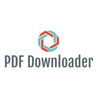

# PDF Downloader

<p align="center">
  
</p>

- An innvoative web scrapping solution to save time.
- Instantly download all necessary pdf files from a webpage.

**Libraries:**

Here's a list of additional modules you might have to download.

- BeautifulSoup4-4.9.1
- lxml-4.5.1 
- wget 3.2
- requests 2.22.0

**How to Use:** 

- Download the Python script and run it on your terminal

  ```
  python3 PdfDownloader.py
  ```
- Upon getting a prompt, enter your course link.

- Your files will be downloaded in the same folder from where you run it.


**Future Work:**

- Deploy with Docker?
- Currently, web pages that end with .html are not correctly parsed. Need to expand the script accordingly. 


**Contribute:**

Feel free to create a pull request if you:

- Have any ideas to improve the code.
- Can think of more use-cases for different university specifiic wesbites.

**Read More:**

- [Medium Article](https://medium.com/the-innovation/notesdownloader-use-web-scraping-to-download-all-pdfs-with-python-511ea9f55e48)
 
